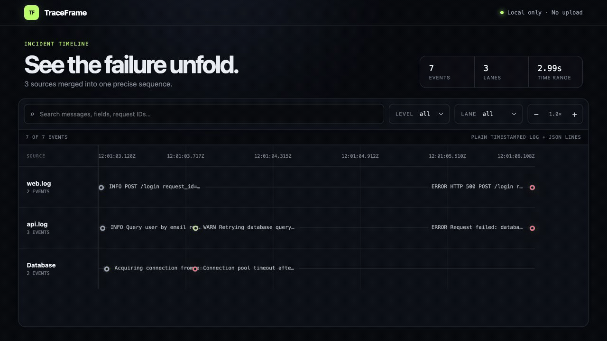

# TraceFrame

Turn raw logs into an interactive incident timeline.

**No instrumentation. No upload. No account.**



TraceFrame detects timestamps, merges events from multiple sources, highlights correlation IDs, and opens a searchable timeline on `127.0.0.1`.

## Try the prototype

Requirements: Node.js 20+ and pnpm.

```bash
pnpm install
pnpm build
pnpm traceframe examples/api-database-timeout --stats
```

The CLI accepts files, directories, and stdin:

```bash
node apps/cli/dist/index.js api.log worker.log
cat app.log | node apps/cli/dist/index.js -
node apps/cli/dist/index.js events.jsonl --parser jsonl --lane service
node apps/cli/dist/index.js app.log --no-open --port 4318
node apps/cli/dist/index.js logs/ --export incident.html
```

## Prototype capabilities

- Plain timestamped logs, JSON Lines, syslog, Docker JSON, and Kubernetes CRI
- ISO 8601, RFC 3339, Unix, syslog, Android logcat, and relative timestamps
- Multiple files, directories, and stdin
- Automatic parser detection
- Request, trace, span, job, transaction, session, thread, and correlation ID extraction
- Search, level and lane filters, timeline zoom, event details, and raw log display
- Standalone HTML export with embedded assets and no local path disclosure
- Local-only HTTP server bound to `127.0.0.1`

## Workspace

```text
apps/cli             CLI and local server
apps/web             React timeline interface
packages/core        Streaming input and event sorting
packages/exporters   Standalone, self-contained HTML export
packages/parser-sdk  Public parser types
packages/parsers     Built-in Plain, JSONL, syslog, Docker, and Kubernetes parsers
examples             Reproducible incident logs
```

## Development

```bash
pnpm test
pnpm typecheck
pnpm --filter @traceframe/web dev
```

TraceFrame processes only the paths explicitly provided to the CLI. It does not include analytics or telemetry, and the local server is not exposed beyond the loopback interface.
